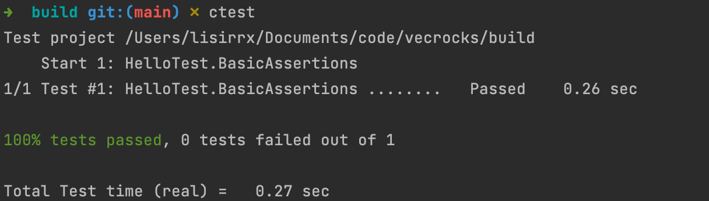

# Vecrocks

Vecrocks is a vector database based on RocksDB

## Development

### 0. Environment

1. `cmake`
2. C++ Compiler support `C++17`

### 1. Build

```shell
mkdir build
cd build
cmake ..  # wait for download RocksDB
make -j1 # change the number for parallel compile
```

### 2. Run Test

```shell
# in the build dir
ctest
```



### 3. Try example

```shell
# in the build/example dir
./example
```